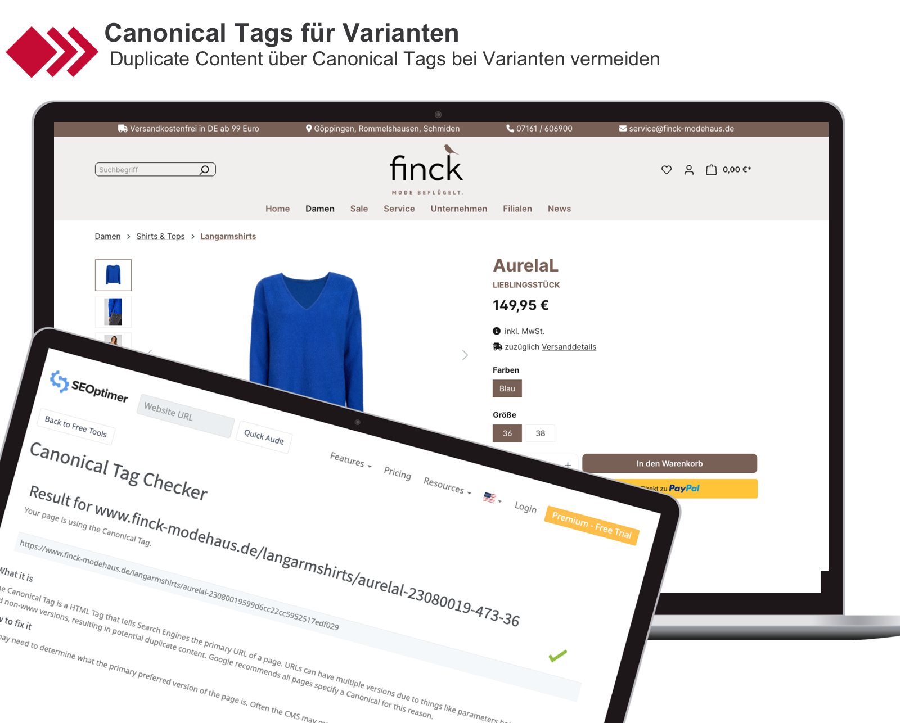

# Shopware Hilfe - Kostenloses Plugin: Canonical Tags für Varianten

## Duplicate Content bei Varianten in Shopware 6 vermeiden

Mit diesem kleinen, aber nützlichem Plugin wird für alle Varianten automatisch ein Canonical Tag auf das Hauptprodukt gesetzt. Dies ist besonders wichtig, da die Varianten in Shopware 6 im Standard unterschiedliche URLs haben und damit Duplicate Content produzieren.

Durch unser Plugin wird bei allen Varianten nur eine URL (die des Hauptprodukts) indexiert und damit Duplicate Content vermieden.

